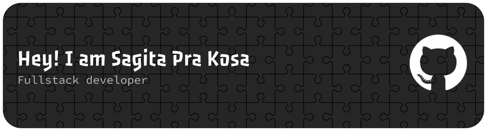

## Hi There I`m Sagita Pra Kosa 👋

- 🔭 I’m currently working on React & Laravel Project
- 🌱 I’m currently learning Deep Learning

---

#### 🛠️skills
##### </> Programming Languages

  

  
 
  
  
  
  
  ***
 ##### 🌐 Framework & Library
  
  
  
  
  
  
  
  
  
  
  
  
  

---
##### ⛁ Databases & Cloud
  
  
  
  

---
##### ☰ Other Tools

  
  
  
  
  
  

---
##### 📱 Social Media

  
  

---
##### 📊 Statistics 

  
  

---
##### 🧩 Arcade & Snake

<picture data-importer="pacman">
  <source media="(prefers-color-scheme: dark)" srcset="https://raw.githubusercontent.com/gitapra0111/gitapra0111/pacman-output/pacman-contribution-graph-dark.svg?game=pacman">
  <source media="(prefers-color-scheme: light)" srcset="https://raw.githubusercontent.com/gitapra0111/gitapra0111/pacman-output/pacman-contribution-graph.svg?game=pacman">
  
</picture>

###

###
